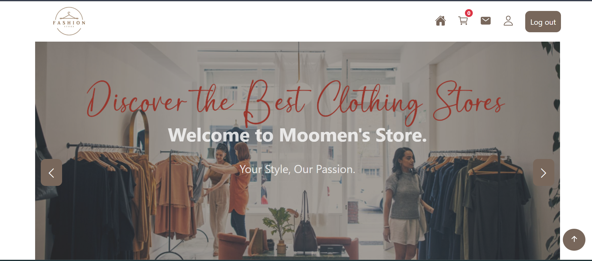
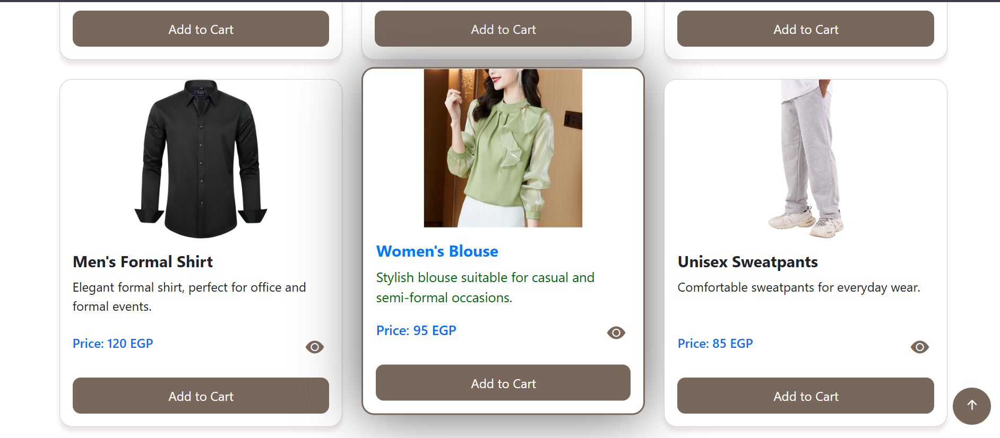
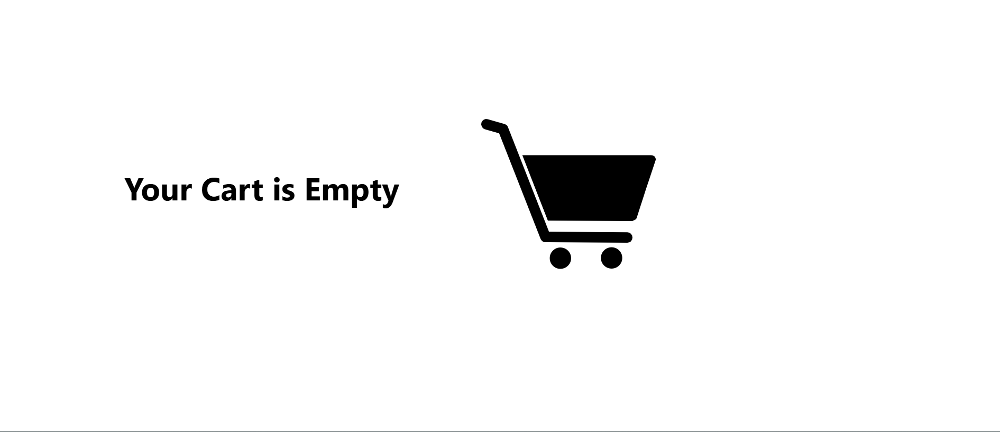

# Moomen Store — E-Commerce Project

**Moomen Store** is a responsive front-end e-commerce template / demo showcasing an online store UI built with HTML, CSS and JavaScript.

> **Live Demo:** [Moomen-Store-E-Commerce-Project](https://moomenabdelshaheed.github.io/Moomen-Store-E-Commerce-Project)






---

## 🔎 Project overview
Moomen Store is a lightweight e-commerce front-end demo that demonstrates product listing, responsive layout, and interactive UI elements (cart actions, product details, filters).  
This repository contains a static front-end (HTML/CSS/JS) and demo assets (including a short promo video).

**Main technologies**
- HTML, CSS, JavaScript  
- Static site (no backend)  
*(Detected repository languages: HTML / JavaScript / CSS)*

---

## ⭐ Features (what to show in the Showcase)
- Responsive product listing and product detail UI  
- Add-to-cart interactions (client-side)  
- Promo / hero section + assets (video / screenshots)  
- Ready to be published as a static demo (GitHub Pages)

---

## 📁 Repository structure (recommended)

Moomen-Store-E-Commerce-Project/
│
├─ index.html # Main landing page of the store
│
├─ assets/ # Media & static assets
│ ├─ images/ # Product images, logos, icons
│ ├─ videos/ # Promo video or demo clips
│ └─ screenshots/ # Screenshots for README/Showcase
│
├─ css/
│ ├─ styles.css # Core styling for layout & components
│ └─ responsive.css # Optional file for responsive tweaks
│
├─ js/
│ ├─ main.js # Core JS for cart actions, UI interactions
│ └─ helpers.js # Optional helper functions (if any)
│
└─ README.md # Project documentation (this file)


---

## 🚀 Getting Started

### 1️⃣ Clone the repository
```bash
git clone https://github.com/moomenabdelshaheed/Moomen-Store-E-Commerce-Project.git
cd Moomen-Store-E-Commerce-Project

